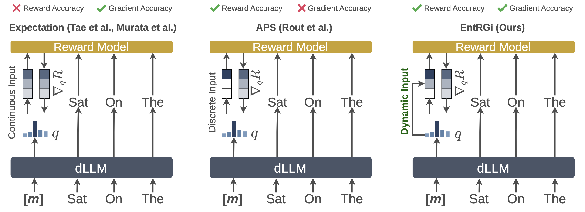
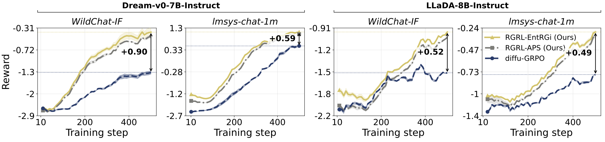

# Entropy Aware Reward Guidance for Diffusion Language Model Alignment

<p align="center">
  <a href="https://atutej.github.io/entrgi-rgrl/"></a>
  <a href="https://arxiv.org/abs/2602.05000"></a>
  <a href="https://github.com/atutej/entrgi-rgrl"></a>
</p>

<p align="center">
  
</p>

<p align="center">
  
</p>

## Overview

**EntRGi** (Entropy-aware Reward Guidance) steers discrete diffusion language models using reward model gradients. At each denoising step, masked-position logits are optimized toward higher reward by back-propagating through the reward model. The key challenge is that reward models expect hard-token embeddings, not soft continuous ones. EntRGi resolves this by adaptively interpolating between soft and hard embeddings using the model's per-token predictive entropy — when entropy is low, soft embeddings are reliable; when entropy is high, we fall back toward hard tokens.

Two guidance variants:
- `entrgi` — entropy-weighted interpolation, w = H(q) / log K
- `aps` — straight-through estimator, w = 1 (APS, Rout et al. 2025)

**RGRL** (Reward Guided Reinforcement Learning) is our post-training recipe: generate reward-guided completions using EntRGi or APS at each training step, then fine-tune the model on those completions.

## Installation

```bash
git clone https://github.com/atutej/entrgi-rgrl.git
cd entrgi-rgrl
pip install torch transformers accelerate datasets trl peft
pip install vllm  # for LMUnit evaluation
cd dllm && pip install -e .
```

### Requirements

- Python 3.10+
- PyTorch 2.0+
- CUDA 11.8+

## Test-Time Adaptation

```bash
cd main_expts

# EntRGi
CUDA_VISIBLE_DEVICES=0,1,2,3 torchrun --nproc_per_node=4 entrgi.py \
    --K 4 --M 3 --eta 0.5 --T 128 --temperature 0.7 \
    --use_entrgi \
    --reward_model Skywork/Skywork-Reward-V2-Qwen3-1.7B \
    --dataset_path THU-KEG/RM-Bench --split train --prompt_field prompt \
    --output_file results/entrgi_results.json

# APS
CUDA_VISIBLE_DEVICES=0,1,2,3 torchrun --nproc_per_node=4 entrgi.py \
    --K 4 --M 3 --eta 0.5 --T 128 --temperature 0.7 \
    --use_aps \
    --reward_model Skywork/Skywork-Reward-V2-Qwen3-1.7B \
    --dataset_path THU-KEG/RM-Bench --split train --prompt_field prompt \
    --output_file results/aps_results.json

# Expectation
CUDA_VISIBLE_DEVICES=0,1,2,3 torchrun --nproc_per_node=4 entrgi.py \
    --K 4 --M 3 --eta 0.5 --T 128 --temperature 0.7 \
    --reward_model Skywork/Skywork-Reward-V2-Qwen3-1.7B \
    --dataset_path THU-KEG/RM-Bench --split train --prompt_field prompt \
    --output_file results/aps_results.json

# Best-of-N baseline
CUDA_VISIBLE_DEVICES=0,1,2,3 torchrun --nproc_per_node=4 bon.py \
    --K 4 --T 128 --temperature 0.7 \
    --reward_model Skywork/Skywork-Reward-V2-Qwen3-1.7B \
    --dataset_path THU-KEG/RM-Bench --split train --prompt_field prompt \
    --output_file results/bon_results.json
```

Run the full experiment suite across all datasets, reward models, and seeds:

## RGRL: Post-Training

### Dream — EntRGi

```bash
CUDA_VISIBLE_DEVICES=0,1 accelerate launch \
    --config_file dllm/scripts/accelerate_configs/zero2.yaml --num_processes 2 \
    dllm/examples/rl/rgrl/dream/train.py \
    --model_name_or_path Dream-org/Dream-v0-Instruct-7B \
    --load_in_4bit True --lora_r 32 --lora_alpha 32 --lora_dropout 0.1 \
    --dataset wildchat \
    --max_steps 500 --max_completion_length 128 --save_steps 100 \
    --learning_rate 5e-6 \
    --num_generations 4 --per_device_train_batch_size 8 \
    --gradient_accumulation_steps 1 --num_iterations 1 \
    --steps 128 --temperature 0.9 \
    --M 1 --eta 0.5 \
    --guidance_type entrgi \
    --guidance_reward_model Skywork/Skywork-Reward-V2-Qwen3-0.6B \
    --reward_model Skywork/Skywork-Reward-V2-Qwen3-0.6B \
    --output_dir ./models/dream-entrgi-wildchat
```

### Dream — APS

```bash
CUDA_VISIBLE_DEVICES=0,1 accelerate launch \
    --config_file dllm/scripts/accelerate_configs/zero2.yaml --num_processes 2 \
    dllm/examples/rl/rgrl/dream/train.py \
    --model_name_or_path Dream-org/Dream-v0-Instruct-7B \
    --load_in_4bit True --lora_r 32 --lora_alpha 32 --lora_dropout 0.1 \
    --dataset wildchat \
    --max_steps 500 --max_completion_length 128 --save_steps 100 \
    --learning_rate 5e-6 \
    --num_generations 4 --per_device_train_batch_size 8 \
    --gradient_accumulation_steps 1 --num_iterations 1 \
    --steps 128 --temperature 0.9 \
    --M 1 --eta 0.5 \
    --guidance_type aps \
    --guidance_reward_model Skywork/Skywork-Reward-V2-Qwen3-0.6B \
    --reward_model Skywork/Skywork-Reward-V2-Qwen3-0.6B \
    --output_dir ./models/dream-aps-wildchat
```

### LLaDA — EntRGi

```bash
CUDA_VISIBLE_DEVICES=0,1 accelerate launch \
    --config_file dllm/scripts/accelerate_configs/zero2.yaml --num_processes 2 \
    dllm/examples/rl/rgrl/llada/train.py \
    --model_name_or_path GSAI-ML/LLaDA-8B-Instruct \
    --load_in_4bit True --lora_r 32 --lora_alpha 32 --lora_dropout 0.1 \
    --dataset wildchat \
    --max_steps 500 --max_completion_length 128 --save_steps 100 \
    --learning_rate 5e-6 \
    --num_generations 4 --per_device_train_batch_size 8 \
    --gradient_accumulation_steps 1 --num_iterations 1 \
    --steps 128 --temperature 0.9 \
    --M 1 --eta 0.5 \
    --guidance_type entrgi \
    --guidance_reward_model Skywork/Skywork-Reward-V2-Qwen3-0.6B \
    --reward_model Skywork/Skywork-Reward-V2-Qwen3-0.6B \
    --output_dir ./models/llada-entrgi-wildchat
```

### LLaDA — APS

```bash
CUDA_VISIBLE_DEVICES=0,1 accelerate launch \
    --config_file dllm/scripts/accelerate_configs/zero2.yaml --num_processes 2 \
    dllm/examples/rl/rgrl/llada/train.py \
    --model_name_or_path GSAI-ML/LLaDA-8B-Instruct \
    --load_in_4bit True --lora_r 32 --lora_alpha 32 --lora_dropout 0.1 \
    --dataset wildchat \
    --max_steps 500 --max_completion_length 128 --save_steps 100 \
    --learning_rate 5e-6 \
    --num_generations 4 --per_device_train_batch_size 8 \
    --gradient_accumulation_steps 1 --num_iterations 1 \
    --steps 128 --temperature 0.9 \
    --M 1 --eta 0.5 \
    --guidance_type aps \
    --guidance_reward_model Skywork/Skywork-Reward-V2-Qwen3-0.6B \
    --reward_model Skywork/Skywork-Reward-V2-Qwen3-0.6B \
    --output_dir ./models/llada-aps-wildchat
```

Supported datasets: `wildchat`, `magpie`, `lmsys`.

## Evaluation

### LMUnit

```bash
python main_expts/lmunit_eval.py \
    --file results/entrgi_results.json \
    --output results/lmunit_results/entrgi_eval.json \
    --model ContextualAI/LMUnit-qwen2.5-72b \
    --tp_size 4
```

### Aggregate Results

```bash
python main_expts/aggregate_results.py ./results
python main_expts/aggregate_results.py ./results --temperature 0.7
python main_expts/aggregate_results.py ./results --methods entrgi aps bon
```

## Hyperparameters

| Parameter | Description | Default |
|-----------|-------------|---------|
| `K` | Completions per prompt | 4 |
| `T` | Denoising steps | 128 |
| `M` | Gradient steps per denoising step | 1–3 |
| `η` (eta) | Adam learning rate for logit optimization | 0.5 |
| `guidance_type` | `entrgi` or `aps` | `entrgi` |

## Models

### Diffusion Models
- [Dream-v0-Instruct-7B](https://huggingface.co/Dream-org/Dream-v0-Instruct-7B)
- [LLaDA-8B-Instruct](https://huggingface.co/GSAI-ML/LLaDA-8B-Instruct)

### Reward Models
- [Skywork-Reward-V2-Qwen3-0.6B](https://huggingface.co/Skywork/Skywork-Reward-V2-Qwen3-0.6B)
- [Skywork-Reward-V2-Qwen3-1.7B](https://huggingface.co/Skywork/Skywork-Reward-V2-Qwen3-1.7B)
- [Skywork-Reward-V2-Qwen3-4B](https://huggingface.co/Skywork/Skywork-Reward-V2-Qwen3-4B)

## Project Structure

```
entrgi/
├── main_expts/
│   ├── entrgi.py              # Test-time adaptation (EntRGi / APS)
│   ├── bon.py                 # Best-of-N baseline
│   ├── lmunit_eval.py         # LMUnit evaluation
│   ├── aggregate_results.py   # Results aggregation
└── dllm/
    └── examples/rl/rgrl/
        ├── dream/train.py     # RGRL training for Dream
        └── llada/train.py     # RGRL training for LLaDA
```

## Citation

```bibtex
@article{tejaswi2026entrgi,
  title   = {Entropy Aware Reward Guidance for Diffusion Language Model Alignment},
  author  = {Tejaswi, Atula and Rout, Litu and Caramanis, Constantine and 
             Shakkottai, Sanjay and Sanghavi, Sujay},
  journal = {arXiv preprint arXiv:2602.05000},
  year    = {2026}
}
```

## Acknowledgments

- [APS](https://arxiv.org/abs/2510.02291) - Test-Time Anchoring for Discrete Diffusion Posterior Sampling
- [Dream](https://github.com/Dream-org/Dream) - Discrete diffusion language model
- [LLaDA](https://github.com/GSAI-ML/LLaDA) - Large language diffusion with masking
- [Skywork-Reward](https://huggingface.co/Skywork) - Reward models
- [LMUnit](https://huggingface.co/ContextualAI/LMUnit-qwen2.5-72b) - Evaluation model
- [dllm](https://github.com/ZHZisZZ/dllm) - Simple Diffusion Language Models
